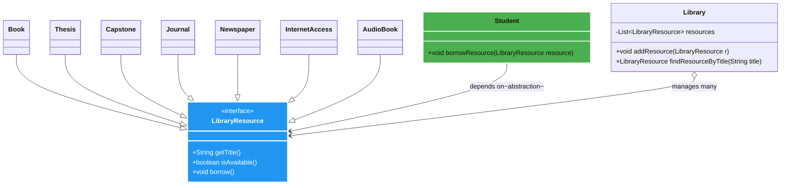

# 🏛️ NEU Library Resource System  
**SOLID-Powered • DIP-First • Future-Proof Refactoring**


> A clean, extensible library management system that follows **all SOLID principles** — built to handle books, journals, theses, capstones, newspapers, internet access… and any new resource type **without ever touching the Student class again**.

---

## 📖 Problem Statement
The NEU Library offers a variety of resources, including books, theses, capstones, internet access, journals, and newspapers.  
Currently, the `Student` object has methods like `borrowBook()`, `borrowJournal()` etc., which directly depend on specific resource types.

**Goal**: Refactor the system to strictly follow the **Dependency Inversion Principle (DIP)** while preserving **all SOLID principles**, making it flexible for future resources (AudioBook, EJournal, VideoCourse, etc.) **without modifying existing code**.

---

## ✨ What Makes This Solution Stand Out?

- ✅ **Zero concrete dependencies** in `Student` — only depends on `LibraryResource` abstraction  
- ✅ **Fully extensible** — add new resource types in seconds  
- ✅ **Maintains every SOLID principle** (SRP, OCP, LSP, ISP, DIP)  
- ✅ **Realistic TestProgram** that proves the refactoring works  
- ✅ Beautiful, auto-rendering UML Class Diagram  

---

## 🧩 UML Class Diagram



---

## 🎯 SOLID Principles Applied

| Principle | How It's Achieved |
|---------|-------------------|
| **S**ingle Responsibility | Each class has one clear job |
| **O**pen-Closed | New resources added **without changing** existing classes |
| **L**iskov Substitution | Any `LibraryResource` can replace another seamlessly |
| **I**nterface Segregation | Minimal, focused interface |
| **D**ependency Inversion | `Student` depends on **abstraction**, not concrete classes |

---

## 📁 Project Structure
```
neu-library-solid-refactor/
├── README.md
└── neu/
    └── library/
        ├── LibraryResource.java          ← Core abstraction
        ├── Book.java
        ├── Thesis.java
        ├── Capstone.java
        ├── Journal.java
        ├── Newspaper.java
        ├── InternetAccess.java
        ├── AudioBook.java                ← Future resource example
        ├── Student.java                  ← DIP-compliant
        ├── Library.java
        └── TestProgram.java              ← Full validation test
```

---

## 🚀 How to Run

```bash
# 1. Clone the repo
git clone https://github.com/YOUR_USERNAME/neu-library-solid-refactor.git
cd neu-library-solid-refactor

# 2. Compile
javac neu/library/*.java

# 3. Run the demonstration
java neu.library.TestProgram
```

**Expected Output** includes successful borrowing of current resources + the future `AudioBook` — proving the system is truly extensible.

---

## 🌟 Why This Matters
This isn't just a refactor — it's a **blueprint** for building maintainable, scalable Java systems.  
Perfect for students, educators, and developers who want to master **clean architecture** and SOLID design.

---

**Made with ❤️ for clean code & future-proof design**  
**Created by: ** John Lian R. Nerecina
**Github: ** JLNerecina

---

*Star this repo if you love clean, extensible code! ⭐*

